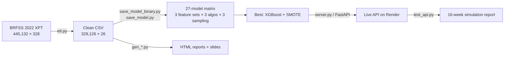

# Obesity Risk Prediction from Lifestyle Behaviors

> Predicting overweight/obesity risk from **everyday behaviors alone** — no medical records required — using CDC BRFSS 2022 (n = 329,126), served as a live FastAPI on Render.

[](https://obesity-api-2-2ro4.onrender.com/docs)
[](https://obesity-api-2-2ro4.onrender.com/docs)
[]()
[]()

This was my Master's machine-learning final project. The full journey — from a 445k-row raw CDC survey file, through ETL, a 27-model comparison matrix, to a deployed prediction API and an interactive demo — is captured here.

---

## 🎯 The core thesis

> **You don't need any medical record to estimate obesity risk.**
> Using only daily behaviors (sleep, smoking, alcohol, exercise, self-rated health), a 6-feature model reaches **F1 = 0.608**. Adding demographics and health perceptions (15 features) reaches **F1 = 0.680** — which nearly matches the 0.687 you'd get by adding *every* chronic-disease diagnosis.
>
> The marginal value of 7 chronic-disease history variables is < 1% F1. This supports **behavior-first public-health intervention**.

---

## 📊 Results

### Binary classification — Normal (BMI < 25) vs Overweight+Obese (BMI ≥ 25)

| Feature set    | # Features | Best model      | Binary F1  |
| -------------- | ---------- | --------------- | ---------- |
| `Full_25feat`  | 25         | XGBoost + SMOTE | **0.6867** |
| `Behav_15feat` | 15         | XGBoost + SMOTE | **0.6800** |
| `Core_6feat`   | 6          | XGBoost + SMOTE | **0.6082** |

### 3-class — Normal / Overweight / Obese

| `Full_25` | `Behav_15` | `Core_6` |
| --------- | ---------- | -------- |
| 0.4955    | 0.4831     | 0.4187   |

### Key findings

1. **Behav_15 vs Full_25 differ by only 0.0067 F1** — removing all 7 chronic-disease history variables costs < 1% performance.
2. **The bottleneck is the Normal/Overweight boundary, not the features** — every group gains a consistent +0.19 F1 when collapsing to the binary task.
3. **A cross-sectional model cannot capture longitudinal change** — in 16-week simulations, `Core_6` (pure behavior) responds correctly to behavior improvement, while `Behav_15` is anchored by static demographics (e.g. "middle-aged male" is a high-risk population cell regardless of individual behavior change). This is a feature of cross-sectional survey data, not a bug — and a strong discussion point.

---

## 🏗️ Pipeline



**Feature sets (stepwise elimination design):**

| Set            | Composition                                                       |
| -------------- | ---------------------------------------------------------------- |
| `Full_25feat`  | Everything: behaviors + health + demographics + 7 chronic diseases |
| `Behav_15feat` | Behaviors (5) + health status (5) + demographics (5), no disease history |
| `Core_6feat`   | Pure behavior: sleep, smoking, alcohol (any + amount), exercise, self-rated health |

---

## 🚀 Live API

Base URL: **https://obesity-api-2-2ro4.onrender.com**
Interactive docs: **/docs** (Swagger UI)

> ⏳ Free Render tier — the first request may take 30–60 s to cold-start.

### `POST /predict/core6` — 6 fields, F1 = 0.608

```bash
curl -X POST https://obesity-api-2-2ro4.onrender.com/predict/core6 \
  -H "Content-Type: application/json" \
  -d '{
    "sleep_hours": 7.0,
    "smoking_status": 4,
    "drank_any": 1,
    "drinks_per_week": 3.5,
    "exercised": 1,
    "general_health": 2
  }'
```

```json
{
  "model": "core6",
  "prediction": 0,
  "label": "Normal",
  "probability": { "normal": 0.71, "overweight_obese": 0.29 }
}
```

### `POST /predict/behav15` — 15 fields, F1 = 0.680

Adds health status (mental/physical unhealthy days, difficulty walking, depression) and demographics (sex, age, education, income, employment). See `/docs` for the full schema.

---

## 📁 Repository structure

```
.
├── etl.py                  # BRFSS 2022 XPT → cleaned 329k-row dataset
├── save_model.py           # Trains 3-class models (27-model matrix)
├── save_model_binary.py    # Trains binary models (deployed)
├── server.py               # FastAPI app (core6 + behav15 endpoints)
├── test_api.py             # 6-scenario × 16-week simulation report generator
├── gen_master_report.py    # Main analysis report (HTML, charts embedded)
├── gen_report.py           # 27-model raw results report
├── gen_columns_html.py     # 328-variable BRFSS reference table
├── gen_slides.py           # Slide deck generator (pptx + reveal.js)
├── gen_deck.py             # Presentation deck generator
├── models_binary/          # Deployed models + feature columns (.pkl)
├── requirements.txt
└── Procfile                # Render deployment entrypoint
```

> Raw data (`data/`), generated reports (`outputs/`), the 3-class models (`models/`), and the local demo site are git-ignored to keep the repo lean. The demo was presented locally in-browser while calling this live API.

---

## 🔧 Reproduce locally

```bash
pip install -r requirements.txt

# 1. ETL  (requires the raw LLCP2022.XPT from CDC BRFSS 2022)
python etl.py

# 2. Train models
python save_model_binary.py    # binary (deployed)
python save_model.py           # 3-class

# 3. Serve the API
uvicorn server:app --reload     # → http://127.0.0.1:8000/docs

# 4. Generate the 16-week simulation report
python test_api.py
```

---

## 🧰 Tech stack

**ML** scikit-learn · XGBoost · imbalanced-learn (SMOTE) · pandas / numpy
**API** FastAPI · Uvicorn · Pydantic · deployed on Render
**Reporting** matplotlib · python-pptx · Reveal.js · GSAP (interactive deck)
**Data** CDC BRFSS 2022 (Behavioral Risk Factor Surveillance System)

---

## 📌 Notes

- Target: `_BMI5CAT` from BRFSS, with Underweight merged into Normal.
- Class imbalance handled with SMOTE; XGBoost consistently won across all 3 sampling strategies.
- Model is **cross-sectional** — it estimates population-level risk for a demographic+behavior profile, not an individual's longitudinal trajectory (see Key Finding #3).
